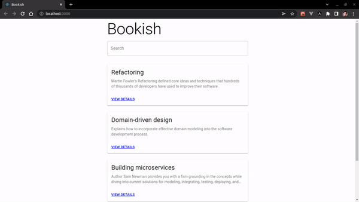
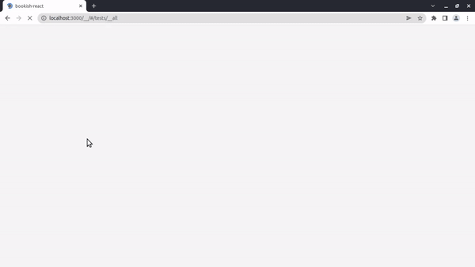

# Test-Driven Development with React

Projects from the book [Test-Driven Development with React](https://www.amazon.com.br/Test-Driven-Development-React-Apply-Applications/dp/1484269713) by Juntao Qiu.

## Notes

- This project uses `Node 16.14.2`.
- `bookish-react` has old dependencies and `bookish-react-new` has updated dependencies.

## References

- [React Testing Library best practices](https://www.benmvp.com/blog/react-testing-library-best-practices/)
- [10 Tips for Better Redux Architecture](https://medium.com/javascript-scene/10-tips-for-better-redux-architecture-69250425af44)
- [Observer Synchronization](https://martinfowler.com/eaaDev/MediatedSynchronization.html)
- [React/Redux Tips: Better Way to Handle Loading Flags in Your Reducers](https://medium.com/stashaway-engineering/react-redux-tips-better-way-to-handle-loading-flags-in-your-reducers-afda42a804c6)

## Preview

### Bookish

### Tests

